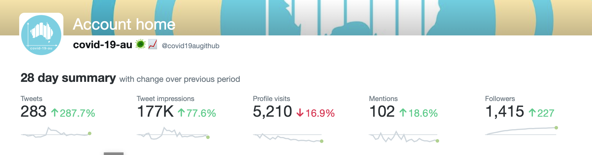
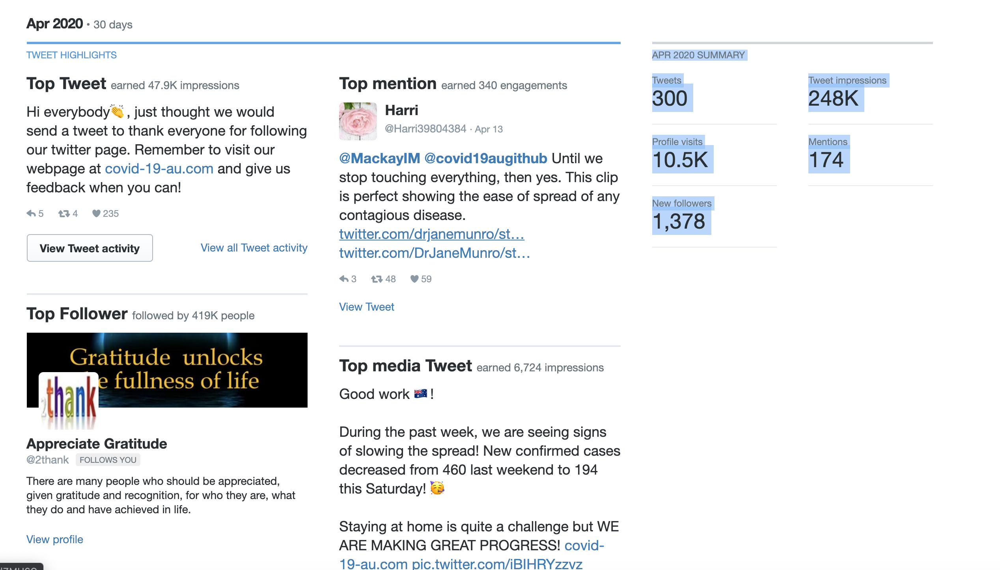
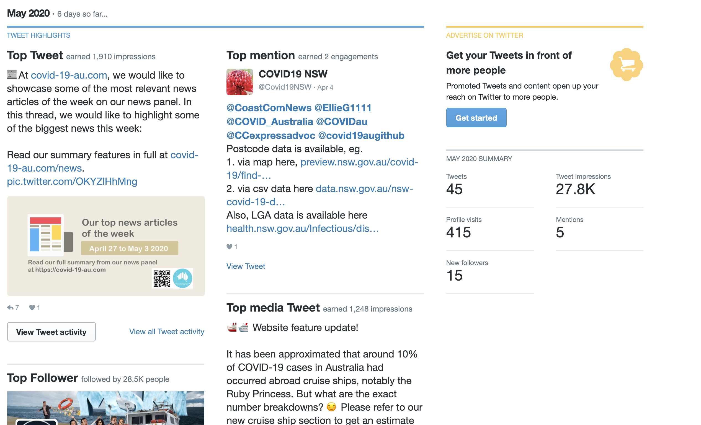
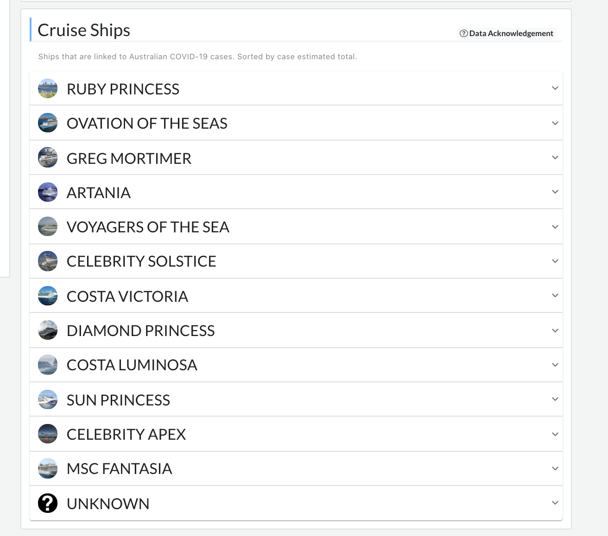

__Description__

A couple of simple scripts I used when I was in responsible for twitter promotions at https://covid-19-au.com/, from April 2020 to the start of May 2020 (7th of May 2020). During this time I was responsible for 

* co-ordinating posts on the twitter platform  
* writing pitches and creating promotional videos about new website features on the twitter platform
* writing the daily summary of content website, which was then put together initially by Dil Kaur, and subsequently automated by myself. The summary was used as promotional material for facebook, twitter and instagram. Examples can be seen both on twitter and facebook.  See https://twitter.com/covid19augithub/status/1252224371923378176 and https://www.facebook.com/photo?fbid=131977335118520&set=pcb.131977535118500. 
* I also wrote two pieces for social promotion in the covid-19-au blog section. They are: https://covid-19-au.com/blog/post/Planning_a_road_to_recovery_How_will_COVID_19_restrictions_ease_in_Australia- https://covid-19-au.com/blog/post/Non_therapeutic_COVID_19_interventions

At first the most of the posts were done on my own, with guidance from the promotion head Ruby Yeo. However as the twitter platform gained more followers Elizabeth Hoysted joined our humble team in May to help with posting. 

In this short amount of time, the twitter page had accumulated more than 1,415 followers and gained more than 177K tweet impressions. Consequently along with promotion in other social media sites, like facebook, wechat and instagram, we had gained over 3 Billion views. 

Examples from Twitter analytics of our progress is shown below: 

(Pictures taken on 7th of May 2020)

A short description of the files in this repository are shown below:

* Twitter-statistics-bot - an promotional twitter bot which automatically scrapes the https://covid-19-au.com/ and provides informative tweets about the developments of COVID-19 in Australia. See it in action: https://twitter.com/covid_au. 
* Twitter-schedule-bot - a scheduler which schedules twitter posts 
* Daily summary files - files to semi-automate the transfer of the daily summary content to photoshop files. 

Aside from promotions, I also manually collected data for cruiseships and the Northern Territory and Tasmania. Notably some of my work shown in the images below: 

